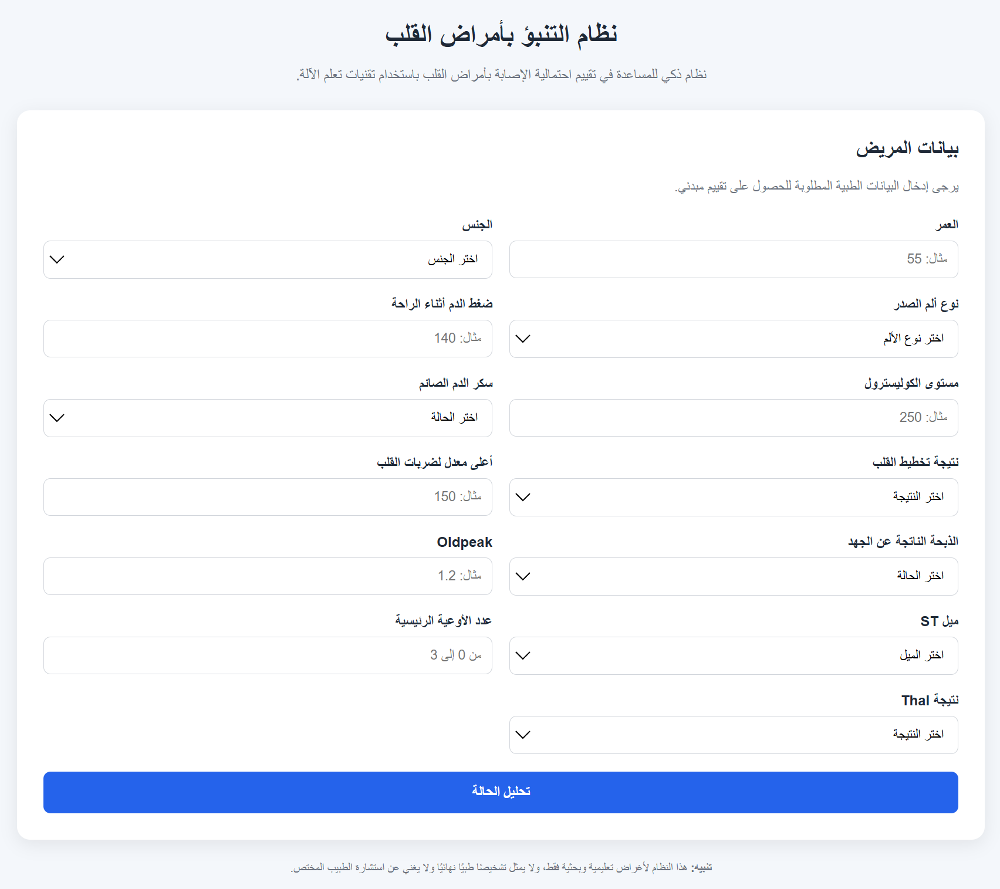

# Heart Disease Prediction System Using Machine Learning

## Overview

This project is an intelligent heart disease prediction system developed using Machine Learning techniques.

The system analyzes medical features related to a patient and uses a trained Machine Learning model to provide an initial prediction of the possibility of heart disease.

### Main Features

- Heart disease prediction
- Prediction probability
- Risk level classification
- Web-based interface
- Flask REST API
- Input validation
- Feature importance analysis
- Saved Machine Learning model

---

## 1. Project Objectives

The project demonstrates a complete Machine Learning workflow for a medical prediction problem.

The workflow includes:

- Data exploration and analysis
- Data cleaning and preprocessing
- Missing-value handling
- Exploratory Data Analysis
- Data visualization
- Training multiple Machine Learning models
- Model comparison
- Hyperparameter optimization
- Feature importance analysis
- Model evaluation
- Model saving
- Flask REST API development
- Web interface development
- Input validation

---

## 2. Technologies Used

- Python
- Pandas
- NumPy
- Matplotlib
- Seaborn
- Scikit-learn
- Joblib
- Flask
- HTML
- CSS
- JavaScript
- Jupyter Notebook

---

## 3. Dataset

The project uses the **Heart Disease Data** dataset obtained from Kaggle.

### Dataset Source

https://www.kaggle.com/datasets/redwankarimsony/heart-disease-data

The dataset is based on the well-known UCI Heart Disease dataset and contains medical information that can be used for heart disease classification.

The dataset includes features such as:

- Age
- Sex
- Dataset source
- Chest pain type
- Resting blood pressure
- Cholesterol
- Fasting blood sugar
- Resting ECG results
- Maximum heart rate
- Exercise-induced angina
- ST depression
- ST slope
- Number of major vessels
- Thalassemia

### Target Variable

The original target was transformed into a binary classification problem:

- `0` → No heart disease
- `1` → Heart disease

---

## 4. Main Features

| Feature | Description |
|---|---|
| `age` | Patient age |
| `sex` | Patient sex |
| `dataset` | Dataset source |
| `cp` | Chest pain type |
| `trestbps` | Resting blood pressure |
| `chol` | Serum cholesterol |
| `fbs` | Fasting blood sugar |
| `restecg` | Resting ECG results |
| `thalch` | Maximum heart rate achieved |
| `exang` | Exercise-induced angina |
| `oldpeak` | ST depression |
| `slope` | Slope of the ST segment |
| `ca` | Number of major vessels |
| `thal` | Thalassemia result |

---

## 5. Data Preprocessing

Several preprocessing steps were applied before model training.

### Data Exploration

The dataset was inspected to identify:

- Number of rows and columns
- Data types
- Missing values
- Unique values
- Statistical properties
- Feature distributions

### Missing Values

Missing values were handled using appropriate strategies for numerical and categorical variables.

Numerical features were processed using median-based imputation, while categorical features were processed using the most frequent value.

### Removing the ID Feature

The `id` column was removed because it represents a record identifier rather than a medical characteristic.

Removing it prevents the model from learning patterns related to record identifiers instead of meaningful medical information.

### Target Variable

A binary target variable named `target` was created:

- `0` → No heart disease
- `1` → Heart disease

---

## 6. Exploratory Data Analysis

Exploratory Data Analysis was performed to understand the dataset and identify relationships between medical features and the target variable.

The analysis included:

- Histograms
- Boxplots
- Count plots
- Correlation heatmaps
- Distribution analysis
- Categorical feature analysis

---

## 7. Data Preparation

The dataset was divided into:

- 80% Training Data
- 20% Testing Data

The `stratify` parameter was used to maintain a similar class distribution between the training and testing datasets.

### Numerical Features

Numerical features were standardized using `StandardScaler`.

### Categorical Features

Categorical features were converted into numerical representations using `OneHotEncoder`.

Both preprocessing steps were integrated into a Scikit-learn `Pipeline`.

---

## 8. Machine Learning Models

Several Machine Learning algorithms were evaluated:

1. Logistic Regression
2. Decision Tree
3. Random Forest
4. K-Nearest Neighbors
5. Support Vector Machine

The models were compared using:

- Accuracy
- Precision
- Recall
- F1-Score
- ROC-AUC

---

## 9. Model Selection

Random Forest achieved strong performance compared with the other evaluated models.

The model was optimized using `GridSearchCV`.

The tested hyperparameters included:

- `n_estimators`
- `max_depth`
- `min_samples_split`
- `min_samples_leaf`

The optimized Random Forest model was evaluated again after removing the `id` feature.

---

## 10. Model Evaluation

The final model was evaluated using an independent test set.

### Accuracy

Measures the percentage of correctly classified samples.

### Precision

Measures how many samples predicted as positive were actually positive.

### Recall

Measures how effectively the model identifies positive cases.

### F1-Score

Provides a balance between Precision and Recall.

### ROC-AUC

Measures the model's ability to distinguish between the two classes.

---

## 11. Final Model Results

After removing the `id` feature, the Random Forest models were evaluated on the test dataset.

| Model | Accuracy | Precision | Recall | F1-Score | ROC-AUC |
|---|---:|---:|---:|---:|---:|
| Random Forest | 0.8478 | 0.8558 | 0.8725 | 0.8641 | 0.9314 |
| Optimized Random Forest | 0.8424 | 0.8476 | 0.8725 | 0.8599 | 0.9319 |

The optimized Random Forest achieved the highest ROC-AUC among the two configurations evaluated after removing the ID feature.

The ROC-AUC was approximately **93.19%**.

---

## 12. Feature Importance

Random Forest Feature Importance was used to identify the features that contributed most to the model's predictions.

The `id` feature was explicitly removed before model training so that it could not influence feature importance.

---

## 13. Model Saving

The trained model was saved using Joblib.

The resulting model file is:

`heart_disease_model.pkl`

The saved Pipeline contains:

- Data preprocessing
- Numerical feature transformation
- Categorical feature encoding
- Random Forest classifier

This allows the API to load the model without retraining it every time.

---

## 14. Flask REST API

A REST API was developed using Flask.

### Main Endpoint

`GET /`

Displays the web interface.

### Prediction Endpoint

`POST /predict`

Accepts patient information in JSON format and returns the prediction result.

### Required Fields

- `age`
- `sex`
- `dataset`
- `cp`
- `trestbps`
- `chol`
- `fbs`
- `restecg`
- `thalch`
- `exang`
- `oldpeak`
- `slope`
- `ca`
- `thal`

---

## 15. Example API Request

```json
{
    "age": 55,
    "sex": "Male",
    "dataset": "Cleveland",
    "cp": "typical angina",
    "trestbps": 140,
    "chol": 250,
    "fbs": false,
    "restecg": "normal",
    "thalch": 150,
    "exang": false,
    "oldpeak": 1.2,
    "slope": "flat",
    "ca": 0,
    "thal": "normal"
}
```

---

## 16. Example API Response

```json
{
    "prediction": 0,
    "probability": 0.439,
    "risk_level": "متوسط",
    "diagnosis": "لا يوجد احتمال مرتفع للإصابة بمرض القلب"
}
```

The response contains:

- `prediction`: Predicted class
- `probability`: Predicted probability of heart disease
- `risk_level`: Application risk category
- `diagnosis`: Human-readable interpretation

---

## 17. Risk Levels

| Probability | Risk Level |
|---|---|
| Less than 30% | Low |
| 30% to less than 70% | Medium |
| 70% or higher | High |

These thresholds are application-level rules and are not clinically validated diagnostic thresholds.

---

## 18. Input Validation

The API validates:

- Required fields
- Unknown fields
- Categorical values
- Numerical values
- Numerical ranges
- JSON request format

For example, an age value of `-5` is rejected before reaching the Machine Learning model.

This prevents invalid input from being processed by the prediction pipeline.

---

## 19. Web Interface

A web interface was developed using:

- HTML
- CSS
- JavaScript

The interface allows users to enter patient information through a form.

### Application Screenshot



The workflow is:

Patient Data → Web Interface → JavaScript → Flask API → Machine Learning Model → Prediction → Probability → Risk Level

The prediction result is displayed directly on the web page.

---

## 20. Project Structure

```text
Heart-Disease-Prediction/
│
├── app.py
├── heart_disease_analysis.ipynb
├── heart_disease_model.pkl
├── heart_disease_uci.csv
├── requirements.txt
├── README.md
├── LICENSE
│
├── templates/
│   └── index.html
│
└── static/
    └── css/
        └── style.css
```

---

## 21. Requirements

The project requires:

- Python 3
- pip
- Flask
- Pandas
- NumPy
- Scikit-learn
- Joblib

Jupyter Notebook is required to reproduce the data analysis and model training process.

The exact installed package versions are available in `requirements.txt`.

---

## 22. Installation

Clone the repository:

```bash
git clone <repository-url>
```

Move into the project directory:

```bash
cd Heart-Disease-Prediction
```

Create a virtual environment:

```bash
python3 -m venv venv
```

Activate the environment on Linux/macOS:

```bash
source venv/bin/activate
```

On Windows:

```bash
venv\Scriptsctivate
```

Install the required packages:

```bash
pip install -r requirements.txt
```

---

## 23. Running the Application

Start the Flask application:

```bash
python app.py
```

The application will run at:

http://127.0.0.1:5000/

Open the address in a web browser to access the prediction interface.

---

## 24. Testing the API

The prediction endpoint can be tested using `curl`:

```bash
curl -X POST http://127.0.0.1:5000/predict -H "Content-Type: application/json" -d '{
    "age": 55,
    "sex": "Male",
    "dataset": "Cleveland",
    "cp": "typical angina",
    "trestbps": 140,
    "chol": 250,
    "fbs": false,
    "restecg": "normal",
    "thalch": 150,
    "exang": false,
    "oldpeak": 1.2,
    "slope": "flat",
    "ca": 0,
    "thal": "normal"
}'
```

---

## 25. Jupyter Notebook

The file `heart_disease_analysis.ipynb` contains the Machine Learning workflow, including:

1. Importing libraries
2. Loading the dataset
3. Exploring the data
4. Checking missing values
5. Cleaning the dataset
6. Exploratory Data Analysis
7. Data visualization
8. Feature preprocessing
9. Train/test splitting
10. Training Machine Learning models
11. Comparing model performance
12. Hyperparameter tuning
13. Model evaluation
14. Feature importance analysis
15. Saving the final model
16. Testing predictions on new patient data

The Notebook also contains comments and explanations describing the purpose of the implemented code.

---

## 26. Testing

The project was tested at several levels, including:

- Flask application startup
- Main API endpoint
- Prediction endpoint
- JSON request handling
- Missing field validation
- Invalid categorical value validation
- Invalid numerical value validation
- Numerical range validation
- Valid patient prediction
- Loading the saved model
- Web interface prediction

An age value of `-5` was successfully rejected by the API because it was outside the allowed application range.

A valid patient request was successfully processed and returned a prediction, probability, and risk level.

---

## 27. Future Improvements

Possible future improvements include:

- User authentication and authorization
- Patient database integration
- Patient history management
- Prediction history
- Dashboard and analytics
- Patient condition monitoring
- Early warning notifications
- Explainable AI using SHAP
- Deep Learning models
- Automated testing
- Docker support
- Cloud deployment
- Model monitoring and retraining

---

## 28. Limitations

Although the model achieved good performance on the test data, the project has several limitations:

- The dataset is limited compared with real-world medical datasets.
- The model depends on the characteristics of the training dataset.
- Performance may change when using data from different populations or healthcare systems.
- The risk thresholds used by the application are not clinically validated.
- The model does not replace professional medical evaluation.
- The prediction probability should not be interpreted as a clinically validated individual risk score.
- Machine Learning predictions should not be used as an independent basis for medical decisions.

---

## 29. Conclusion

This project demonstrates an end-to-end Machine Learning system for heart disease prediction.

The complete workflow is:

Medical Dataset
↓
Data Cleaning
↓
Exploratory Data Analysis
↓
Feature Preprocessing
↓
Model Training
↓
Model Comparison
↓
Hyperparameter Optimization
↓
Model Evaluation
↓
Feature Importance
↓
Model Saving
↓
Flask REST API
↓
Web Interface
↓
Prediction

The project combines:

- Data Analysis
- Data Visualization
- Machine Learning
- Model Optimization
- Model Interpretation
- REST API Development
- Web Development
- Input Validation

into a single integrated system.

---

## 30. Data Source and Reference

The dataset used in this project was obtained from Kaggle.

**Heart Disease Data**

Kaggle URL:

https://www.kaggle.com/datasets/redwankarimsony/heart-disease-data

The Kaggle dataset is based on the well-known UCI Heart Disease dataset.

The dataset was used as the primary source for data analysis and Machine Learning experiments in this project.

---

# Author

**Abdulrahman Al-Harbi**
